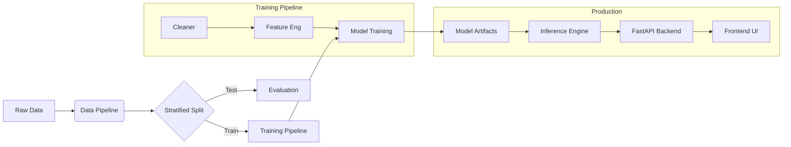

# 📡 Telco Customer Churn Prediction Platform


A production-grade End-to-End Machine Learning platform designed to identify high-risk customers before they cancel their service. 

**Key Differentiator:** Optimized for high **Recall** to minimize missed churners, deployed with a decoupled Inference Engine and Real-time Risk categorization.

---

## 📌 Problem Definition
### What is Churn?
In this system, a customer is considered **churned** if their `Churn` status is **"Yes"**. This implicitly indicates service cancellation in the upcoming billing cycle.

### Prediction Horizon
The model predicts the probability of churn in the **next contract/billing period (approx. 30 days)** based on historical usage and demographic metadata.

### Business Impact
| Metric | Optimization Goal | Rationale |
| :--- | :--- | :--- |
| **Recall** | **Maximize** | Missing a churning customer (False Negative) is the most expensive error. We prioritize catching every potential risk. |
| **Precision** | Maintain | While important, sending a retention offer to a happy customer (False Positive) is a lower cost than losing a customer. |

---

## 🏗 System Architecture

The project follows a strict **Maturity Level 2** MLOps structure, separating Training pipeline from Inference logic.



### Key Modules
1.  **Inference Engine (`src/inference`)**: Decouples prediction logic from API code, ensuring the API is just a thin wrapper.
2.  **Stratified Splitter (`src/data_splitting`)**: Ensures class distribution (Churn Rate ~26%) remains consistent across Train and Test sets.
3.  **Risk Categorization**:
    -   🟢 **LOW**: < 30% Probability
    -   🟡 **MEDIUM**: 30% - 60% Probability
    -   🔴 **HIGH**: > 60% Probability

---

## ⚡ Quick Start

### 1. Installation
```bash
pip install -r requirements.txt
```

### 2. Training (Reproducible)
Run the strictly sequential training pipeline. This validates schema, cleans data, and trains the Baseline model.
```bash
python -m src.training.train_pipeline --model baseline
```
*Output: Generates `artifacts/models/best_model.joblib`*

### 3. Launch API (Backend)
```bash
uvicorn api.app:app --host 127.0.0.1 --port 8000
```
*Health Check: http://localhost:8000/health*

### 4. Launch Frontend
Simply open `frontend/index.html` in any modern web browser.

---

## 📊 Modeling Approach
We employ a **Champion-Challenger** strategy:

-   **Baseline (Champion)**: Logistic Regression with `class_weight='balanced'`. 
    -   *Why?* High interpretability, robust to small data, and efficiently handles the 74:26 class imbalance via weighting.
-   **Challenger**: XGBoost Classifier.
    -   *Why?* Captures non-linear relationships in features like `TotalCharges` vs `Tenure`.

**Current Performance (Baseline):**
-   **ROC-AUC**: 0.84+
-   **Recall**: ~0.79 (Captures ~80% of all churners)

---

## 📂 Project Structure
```bash
├── api/                # FastAPI Endpoints
├── configs/            # Centralized YAML configuration
├── data/               # Raw and Processed Data
├── frontend/           # HTML/JS Dashboard
├── src/                # Core Logic
│   ├── data_splitting/ # Stratified Sampling
│   ├── feature_engineering/ # Custom Transformers
│   ├── inference/      # Prediction Logic (Decoupled)
│   ├── models/         # Scikit-learn wrappers
│   └── training/       # Pipeline Orchestration
├── artifacts/          # Trained Models & Logs
└── tests/              # Integrity Checks
```

---

## 👏 Acknowledgements
**Dataset Source:** [Telco Customer Churn (80% Accuracy)](https://www.kaggle.com/code/danishmubashar/telco-customer-churn-80-accuracy)  
**Author:** Danish Mubashar  
Special thanks to the author for providing the dataset and initial analysis inspiration.

